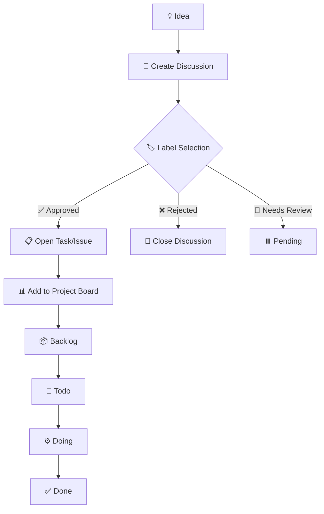

# TaskBoard
Visualize ideas as tasks.

## Architecture Alignment Notice
**This TaskBoard system strictly follows the Mermaid flowchart definition as the source of truth.**

All workflows, automations, and UI behaviors are designed to match the official workflow diagram. Any discrepancies between documentation and implementation are considered bugs and should be reported.

## Official Workflow



## Usage

### Step 1: Generate Task Ideas
1. Copy and paste the markdown from the [AI Prompt](#prompt) into your preferred LLM (ChatGPT, Claude, or Gemini)
2. Provide your idea or memo as input
3. The AI will generate a structured Discussion post

### Step 2: Create Discussion
1. Navigate to [GitHub Discussions - Ideas](https://github.com/Uchida16104/TaskBoard/discussions/new?category=ideas)
2. Paste the AI-generated content
3. Submit the discussion

### Step 3: Label the Discussion
Select one of the following labels for the discussion:

| Label | Behavior | Workflow Action |
|-------|----------|----------------|
| **approved** | Creates an Issue and adds to project board | Discussion → Issue → Project (Backlog) |
| **rejected** | Closes the discussion immediately | Discussion → Closed |
| **needs-review** | Keeps discussion open for further evaluation | Discussion → Pending |

**Note:** Labels must be created in your repository first. Navigate to `Issues → Labels → New label` to add them.

### Step 4: Manage on Project Board
Once approved and converted to an issue:

1. Go to `https://github.com/users/YOUR_USERNAME/projects/PROJECT_NUMBER/views/VIEW_NUMBER`
2. The issue will automatically appear in the **Backlog** column
3. Move tasks through the workflow:
   - **Backlog** → Tasks waiting to be started
   - **Todo** → Tasks ready to work on
   - **Doing** → Tasks currently in progress
   - **Done** → Completed tasks

## Automated Workflows

### Discussion Approval (approved label)
- Automatically creates an Issue
- Adds `from-discussion` label
- Adds task to project board
- Sets initial status as `Backlog`
- Links back to original discussion

### Discussion Rejection (rejected label)
- Closes the discussion
- Adds rejection comment
- Adds `rejected-closed` label

### Issue Creation (when discussion approved)
- Auto-adds to Project Board
- Creates confirmation comment
- Sets `status:backlog` label

### Progress Monitoring (Daily)
- Checks all open issues with `from-discussion` label
- **Warning** after 7 days of inactivity
- **Auto-close** after 30 days of inactivity
- Generates progress summary report

### Project Data Sync (Hourly)
- Fetches latest project data
- Updates `docs/data/projects.json`
- Powers the status dashboard

## Project Board Structure

Create the following columns in your GitHub Project (v2):

| Column Name | Description |
|-------------|-------------|
| Backlog | Tasks that are approved but not yet started |
| Todo | Tasks ready to be worked on next |
| Doing | Tasks currently being worked on |
| Done | Completed tasks |

## Caution

### **Do NOT manually create Issues**
- Issues should only be created through the approved Discussion workflow
- Manual issue creation bypasses the workflow and may cause inconsistencies

### Workflow Consistency
- All changes to the workflow must update both code AND the Mermaid diagram
- The Mermaid diagram is the single source of truth
- Any deviation is considered a bug

## Reference

### Wiki
* [Design Notes](https://github.com/Uchida16104/TaskBoard/wiki/Design-Notes) - Project architecture and design decisions
* [Project Rules](https://github.com/Uchida16104/TaskBoard/wiki/Project-Rules) - Contribution and workflow guidelines

### AI Prompts

Access pre-configured prompts for task generation:

* [ChatGPT Prompt](https://github.com/Uchida16104/TaskBoard/wiki/Prompt-for-ChatGPT)
* [Claude Prompt](https://github.com/Uchida16104/TaskBoard/wiki/Prompt-for-Claude)
* [Gemini Prompt](https://github.com/Uchida16104/TaskBoard/wiki/Prompt-for-Gemini)

Or visit the [AI Prompts Dashboard](https://uchida16104.github.io/TaskBoard/wiki/)

### Dashboard Links

- **Home:** https://uchida16104.github.io/TaskBoard/
- **AI Prompts:** https://uchida16104.github.io/TaskBoard/wiki/
- **Status Dashboard:** https://uchida16104.github.io/TaskBoard/docs/

## System Architecture

### Components

1. **GitHub Discussions** - Idea collection and review
2. **GitHub Actions** - Workflow automation
3. **GitHub Projects v2** - Task management board
4. **GitHub Pages** - Status visualization and documentation

### Automation Files

- `.github/workflows/discussion-approved.yml` - Handles approved discussions
- `.github/workflows/discussion-rejected.yml` - Handles rejected discussions
- `.github/workflows/main.yml` - Adds new issues to project board
- `.github/workflows/progress-monitor.yml` - Monitors task progress
- `.github/workflows/fetch-projects.yml` - Syncs project data

### Data Flow

```
Idea → Discussion → Label → Automation
                            ↓
                     Issue Creation (if approved)
                            ↓
                     Project Board Addition
                            ↓
                  Backlog → Todo → Doing → Done
```

## Configuration

### Required Secrets

- `GH_PAT` - GitHub Personal Access Token with `repo` and `project` scopes

### Required Labels

Create these labels in your repository:

- `approved` - Triggers issue creation
- `rejected` - Triggers discussion closure
- `needs-review` - Marks for further evaluation
- `from-discussion` - Auto-added to issues created from discussions
- `status:backlog` - Task status indicator
- `needs-attention` - Auto-added when task is stale
- `auto-closed` - Auto-added when task auto-closes

## Monitoring & Maintenance

### Daily Automated Tasks
- Progress monitoring runs daily at midnight UTC
- Checks for inactive issues
- Generates summary reports

### Hourly Automated Tasks
- Project data synchronization
- Updates dashboard with latest information

### Manual Maintenance
- Review discussions with `needs-review` label
- Move tasks through project board columns
- Close completed tasks

## Troubleshooting

### Issue not created from approved discussion
1. Check that the `approved` label was applied correctly
2. Verify GitHub Actions workflow ran successfully
3. Check Actions tab for error logs

### Task not appearing on project board
1. Ensure project URL in workflow is correct
2. Verify `GH_PAT` secret has proper permissions
3. Check that issue was created successfully

### Workflow doesn't match documentation
This is a bug! The Mermaid diagram is the source of truth.
1. Open an issue describing the discrepancy
2. Reference which step doesn't match the flowchart
3. Tag as `Architecture / Consistency` issue

## Developer

***Hirotoshi Uchida***

## License

This project follows the workflow automation practices for GitHub-based task management. Feel free to adapt for your own projects while maintaining the workflow consistency principles.
